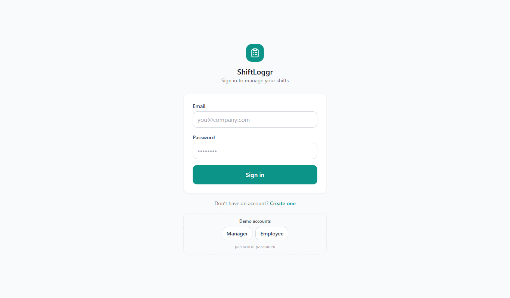
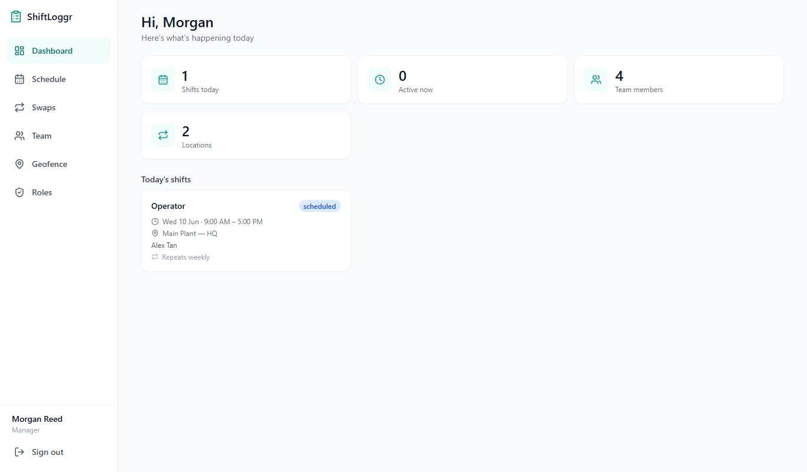
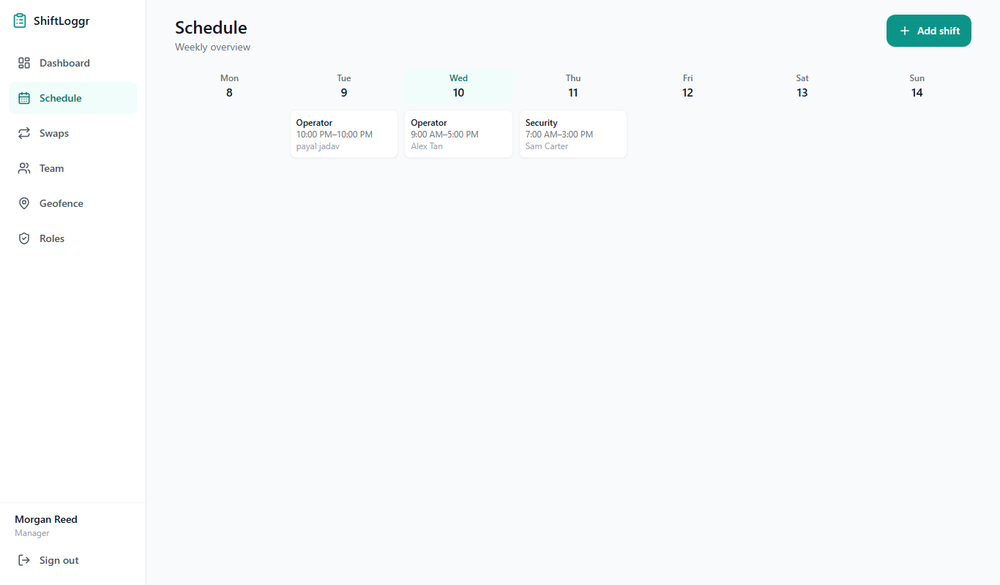
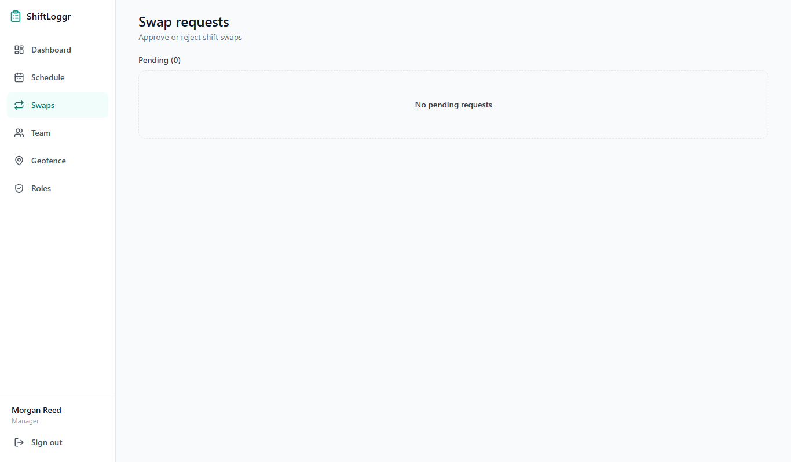
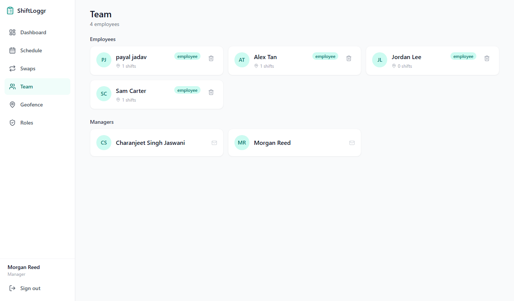
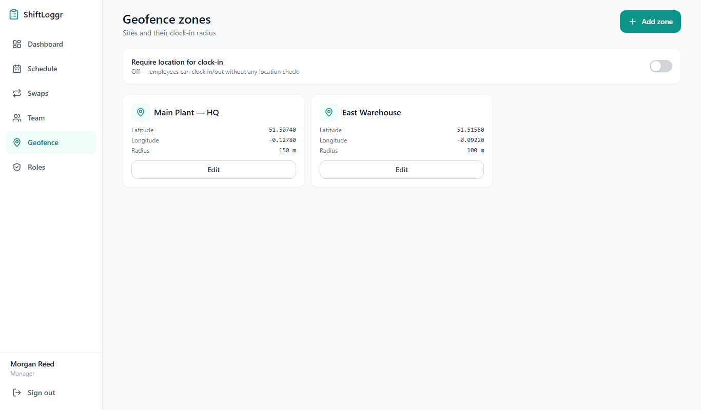
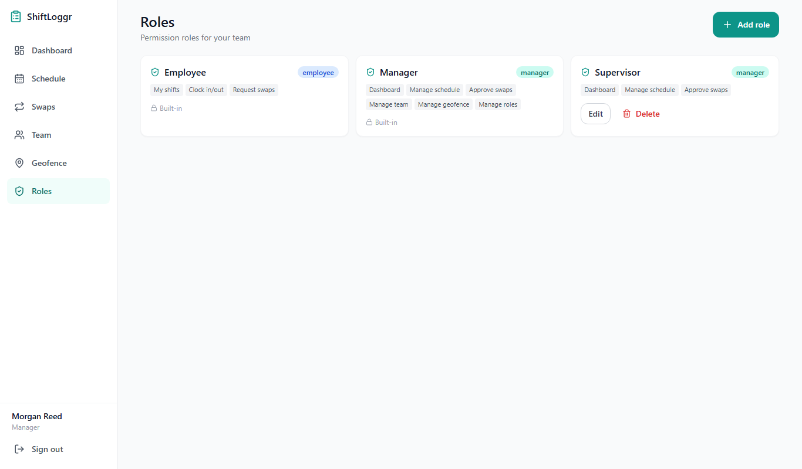
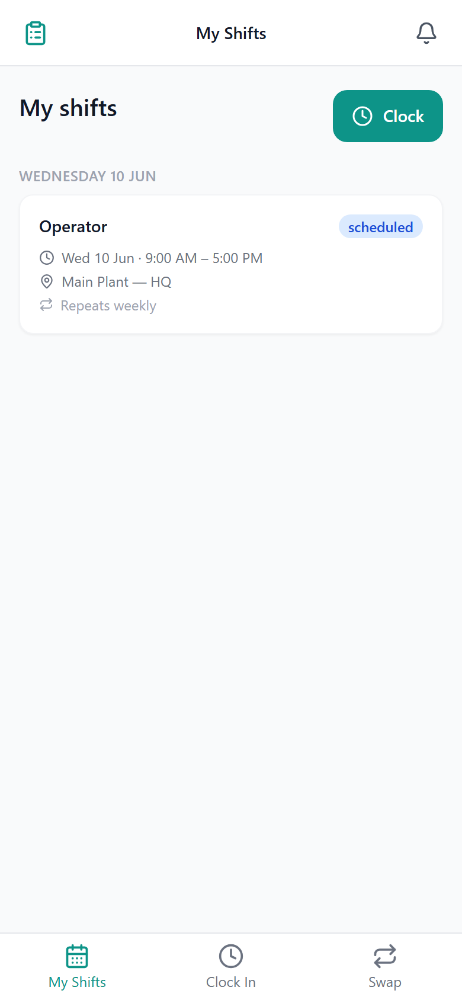
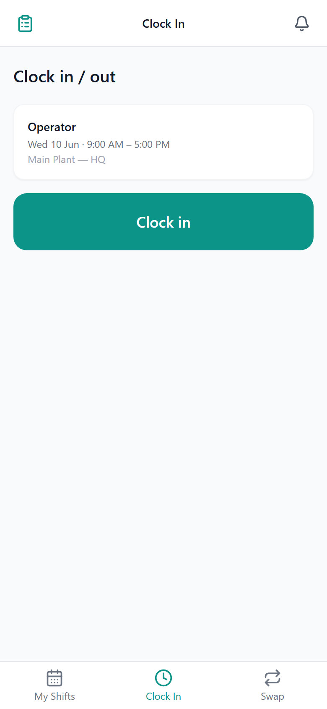
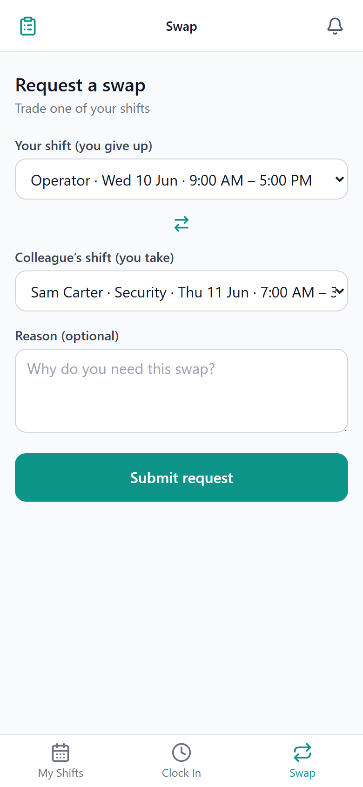

# ShiftLoggr

A responsive, serverless **shift-management web app**. Managers build the weekly
schedule, approve shift swaps, and manage the team from desktop; employees view
their shifts, clock in/out, and request swaps from their phone.

**Stack:** React 19 + TypeScript + Vite · TailwindCSS · Zustand · React Router v6 · **Cloud Firestore** (no backend server) · Firebase Analytics

---

## Screenshots

### Login



### Manager — desktop

| Dashboard | Weekly schedule |
|---|---|
|  |  |

| Swap requests | Team |
|---|---|
|  |  |

| Geofence zones | Roles & permissions |
|---|---|
|  |  |

### Employee — mobile

| My shifts | Clock in / out | Request swap |
|---|---|---|
|  |  |  |

---

## Features

- **Responsive shell** — fixed sidebar on desktop, sticky header + bottom tab bar on mobile (iOS safe-area aware, 44 px touch targets)
- **Custom roles & permissions** — built-in Manager/Employee roles plus manager-created custom roles (e.g. *Supervisor*); navigation, routing and data scope all follow the role's permission set
- **Schedule** — 7-column weekly grid on desktop, date-grouped list on mobile; role dropdown, repeat options, full CRUD
- **Clock in / out** — one-tap clocking with a full shift lifecycle: early clock-out can be resumed until the shift's end time, then it's locked; every attempt is logged
- **Shift history** — employees see past shifts with their actual clock-in/out times
- **Shift swaps** — employees request, managers approve/reject; approval reassigns both shifts atomically (Firestore batch write)
- **Geofencing (toggleable)** — managers define zones (lat/lng + radius) and flip a switch to require employees to be on-site to clock in (Haversine distance check + live inside/outside indicator)
- **Team management** — roster view, delete accounts (with confirmation + assigned-shift warning)
- **Analytics** — page views and key actions (login, clock, swaps, shift CRUD) tracked via Firebase Analytics

## Architecture

Serverless: the React app talks **directly to Cloud Firestore** using the public
web config in `src/firebase.ts`. There is no API server. Login is
Firestore-backed (bcrypt hash compare in the browser) and the session is kept
client-side.

```
src/
├── api/            # Firestore data layer (auth, shifts, swaps, clock, roles, …)
├── components/     # ui kit (Button, Modal, Switch…), layout shell, cards
├── constants/      # permission catalogue, job roles
├── hooks/          # useAuth, usePermissions, useGeofence, useBreakpoint, …
├── pages/          # Login/Register + manager/* + employee/*
├── routes/         # permission-guarded router
├── store/          # zustand: auth session, roles cache
└── utils/          # haversine, date formatting
```

**Firestore collections:** `users`, `roles`, `shifts`, `swapRequests`,
`locations`, `clockLogs`, `settings` — schema documented in
[`../ShiftLoggrBackend/FIRESTORE_SCHEMA.md`](../ShiftLoggrBackend/FIRESTORE_SCHEMA.md).

## Getting started

```bash
npm install
npm run dev          # http://localhost:5173
```

### Demo accounts

| Role | Email | Password |
|------|-------|----------|
| Manager | `manager@shiftloggr.dev` | `password` |
| Employee | `employee@shiftloggr.dev` | `password` |

Or create your own account via **Register** (pick any role, including custom ones).

### Admin scripts (in `../ShiftLoggrBackend`, need the service-account key)

```bash
npm run seed           # populate Firestore with demo data
npm run deploy:rules   # publish Firestore security rules
```

### Regenerate README screenshots

```bash
node scripts/screenshots.mjs http://localhost:5173
```

## ⚠️ Security note

This is a demo/learning project: Firestore rules are open and password hashes
are readable client-side. **Don't store real employee data.** Production
hardening = Firebase Authentication + restrictive security rules. The
service-account JSON (admin key) must never be deployed or committed.
